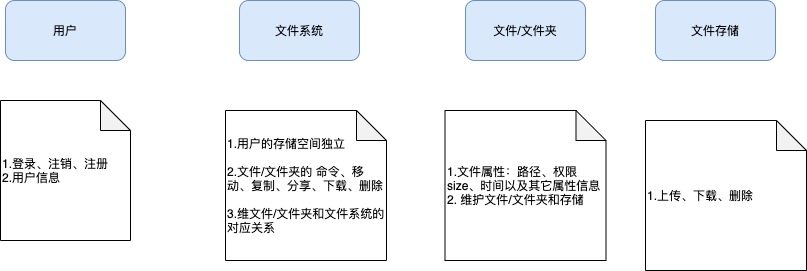
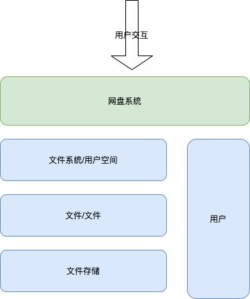

# 一、系统设计

1. ## 系统设计的方法？

   简单而言就是从需求出发，转化成计算语言的设计。

   方法大致如下：

   - 从需求出发，梳理需求。

     > 例如：系统有登陆需求、上传文件等需求

   - 按照面向对象原则，将需求分类，变成模块

     > 例如：登陆、用户信息等都属于用户模块（对象），统计归类为用户模块

   - 按照抽象原则，将需求在模块中实现接口（面向接口）。

2. ## 为什么要面向接口编程？（面向接口编程的好处）

   1.系统的上层逻辑会比较清晰。

   > 大致的流程或者粗的逻辑都在接口与接口间描述情况

   2.解耦模块与模块之间逻辑，解耦实现，系统健壮性好。

   > 模块与模块之间全部按照面向对象设计，充分解耦，一个模块出现问题不会影响其它模块。

   > 接口与实现解耦，实现再垃圾/乱，我重构一遍实现就可以，不影响上层逻辑，重构代价小。

   3.利于后期需求变更和扩展

   > 面向对象和面向接口的最大好处就是利于后期扩展和需求变更，不会出现大面积重构。
   >
   > 后期扩展一般是增加模块或者模块变更，重构/修改代价小。
   >
   > 面向接口实现，例如文件存储，现在需求是minio实现，后期扩展要支持ceph，只需要实现ceph的存储逻辑，不需要修改上层逻辑。

# 二、案例分析

举一个简单的例子，具体阐述整个系统设计的过程。

## 1.案例描述（需求）

- 做一个网盘系统，多用户登录、注销、注册
- 每个用户的存储空间独立、可以设置配额
- 可以上传、下载、删除、修改文件信息、移动复制文件、分享
- 存储支持：本地文件、ceph、minio、oss等。

## 2.模块设计

模块梳理结构

模块调用接头

## 3.接口设计

和模块对应设计，在接口中按照抽象原则设计接口

看源代码。

- UserService

> 负责用户登录、信息等
- FileSystemService

  > 这一层主要是用户空间的信息，用户空间和用户接口直接交互
  > 主要和fileobjectservice的交互

- FileObjectService
> 这一层主要是维护文件/文件夹元数据，以及与存储的关系
> 主要和fileStorageService交互

- FileStorageService
> 负责和具体存储打交道，比如minio、oss、ceph等。
> 如果要换存储或者有多种存储，只需要将这个类按照接口重新实现一遍即可。

## 4.实现

源码用伪代码实现了【上传】和【重命名】两个功能
